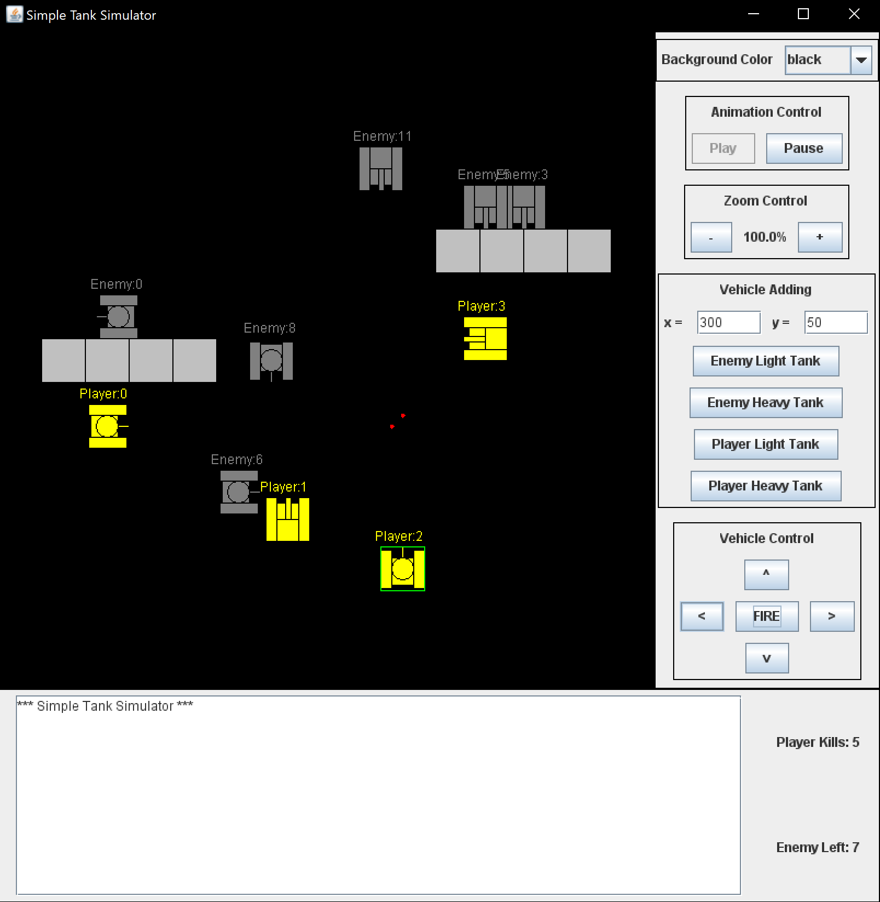

# simple-tank-game
Author: Keren Zhou  
Date: From 2019-09-27 to 2019-10-25  
Summary: A simple tank game written in Java and Swing, a course project for comp86 at Tufts University.  
概述：用Java及其Swing组件写的坦克大战小游戏，塔夫茨大学comp86课程的课程项目。  

 

## Compile and Run
Requirement: JDK 8 or higher version.  

How to compile and run:
* Go to src directory.
* Strongly recommend to remove all the .class file before compiling.
* Compile by command "javac Main.java".
* Run by command "java Main".

## 编译与运行
运行要求：JDK8或更高版本。  

如何运行：
* 进入src目录。
* 编译前建议删除所有.class文件。
* 在命令行中输入"javac Main.java"进行编译。
* 在命令行中输入"java Main"运行游戏。

 

## How to Play

In this game, the player is supposed to control yellow player tanks to eliminate gray enemy tanks.  

At the beginning, there are multiple yellow player tanks available. The player can select one of them by mouse click to control it. The select tank is surrounded by a green rectangle.  
The player can switch to other player tanks at any time using mouse click.  
There is a vehicle control panel in the window. After selecting a tank, the player can use direction buttons to move and turn the selected tank, and can use fire button to fire.  

Pressing the fire button can let the select tank fire a red shell (button) forward. 
Shells can be blocked by an enemy tank or a rock but can pass through a 
player tank. Thus, players do not have to worry about friendly fire.  
If an enemy tank is hit by player's shell, the enemy tank will be destroyed. This adds one to the player kills and minus one to the enemy left on the information board at the bottom of the window.  

There are 2 kinds of tanks, light and heavy. Light tanks moves faster and look slimmer than heavy tanks.  

There are other control widgets in the control panel on the right side 
of the main window.  
Background color combo box can set the canvas background color.  
Animation control has a play and a pause button to start and stop auto 
movements (animation) of enemy tanks.  
Vehicle adding panel has 2 text fields to input the starting position of 
the new vehicle. And tank category buttons decide which kind of tanks will 
be added to the battlefield.  

 

## 玩法
玩家控制黄色己方坦克摧毁灰色地方坦克。  

游戏开始有多辆黄色己方坦克。用鼠标点击选中一辆进行操作。选中的坦克会有绿色方框提示。  
玩家可以随时用鼠标点击切换其他己方坦克。  
窗口右侧偏下有车辆控制面板。当玩家选中一辆己方坦克后，上、下、左、右按钮可控制坦克转向和移动，FIRE按钮可控制开火。  

按下开火按钮后，玩家控制的己方坦克会向前发射一颗红色炮弹。炮弹会被障碍物和敌方坦克阻挡，但会直接穿过其他己方坦克。因此，无需担心误伤。  
当炮弹命中敌方坦克后，该敌方坦克会被立即击毁，同时右下方的玩家击杀数+1，剩余敌方坦克数-1。  

游戏中有两种不同坦克类型，轻坦和重坦，可根据图标区分。轻坦移动速度更快。  

除了坦克控制面板外，窗口右侧还有其他控制选项。  
右上角有背景颜色下拉选项。  
右侧偏上有暂停/继续敌方坦克行动的按钮。  
右侧中间有在指定位置添加己方和敌方坦克的控制选项。  

 

## Files
* spec: Assignment specifications related to this course project for comp86 at Tufts University.
* src: Java source codes for this project. You can compile and run this project under this directory.

## 文件
* spec: 与该项目相关的塔夫斯大学comp86课程的作业要求。
* src: 该项目的Java源代码。可以在该路径下编译与运行该项目。
